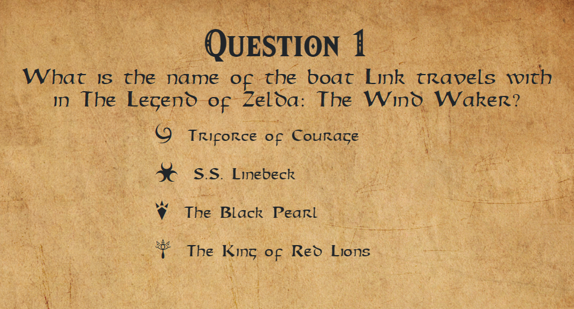
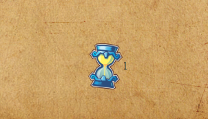
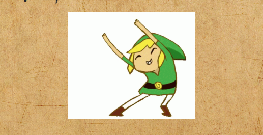
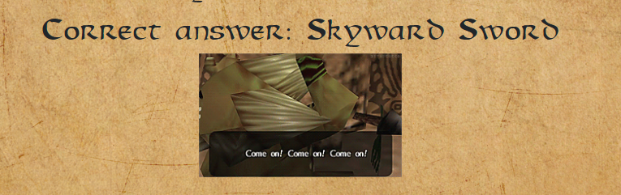
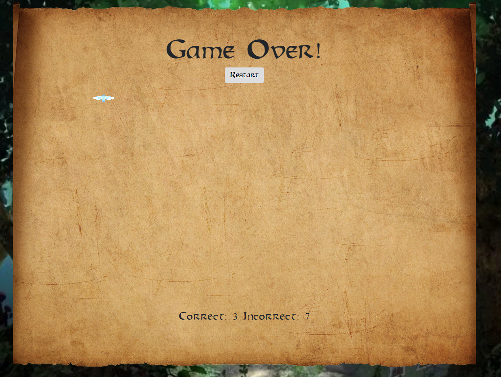

# Legend of Zelda Trivia Game

This is a Zelda themed trivia game! The object of the game is to correctly answer as many of the 10 questions as you can!

To start the game click the start button then the first question will load.

Just click on the answer that you think is correct, but be careful! You only have 15 seconds! The timer is displayed at the bottom and counts down!

When you click on the right answer a happy GIF is diplayed and the next question will load shortly.

When you get the answer wrong then the correct answer will display and a sad GIF will play.

After all 10 questions have been answered then the Game Over screen will display with a total of your correct and incorrect questions

